# Standalone incident evidence architecture

```mermaid
flowchart LR
  S[Retained observed simulator source] --> A[Passive adapter and fault derivatives]
  A --> R[SQLite recorder and producer signature]
  R --> W[Separate same-host witness checkpoint]
  W --> B[Public signed bundle and artifact digests]
  B --> V[Offline verifier]
  V --> Q[Capture diagnostics and execution-time policy]
  Q --> I[Read-only incident review]
  I -. optional local mapping .-> G[GRC Claw bridge compatibility sources]
```

The repository root owns eleven local npm workspaces: nine existing Robot Black Box modules and two selected upstream compatibility source modules. packages/, scripts/, docs/, examples/ and .github/workflows/ are siblings. Relative imports resolve entirely inside this monorepo; no parent checkout is referenced. The existing namespace records the source relationship rather than requiring an upstream installation.

The producer signs ordered envelopes and artifact digests; a separate local witness checkpoints heads; an authority signs capture profiles and action grants where appropriate. Passive sampling issues no action grant. The verifier validates supplied identity snapshots, schemas, order, signatures, artifacts and heads before yielding trusted facts. Integrity, completeness, authorization and capture diagnostics stay distinct.

Simulation evidence is outside the fixed original 46-entry portable package. Bootstrap verifies a reviewer-supplied manifest pin before executing supplied code from a checked snapshot. Local custody/recovery/reviewer checkpoints remain same-host drills; independent identity/head retention is unknown. The optional bridge uses bundled local mapping interfaces and adds no live upstream connection.

Simulator offsets, artificial observation epoch and observed host source/receive clocks remain separate. A local delay fault diagnoses ingestion scheduling, not source freshness or physical safety. See GRC-CLAW-INTEGRATION.md for the optional mapping and RELEASE-SCOPE.md for exclusions.
