# Robot Black Box architecture

This document describes the public reference architecture, trust boundaries, evidence lifecycle, analytical projection and deployment evolution. It distinguishes implemented local behavior from interfaces intended for production integration.

## 1. System context

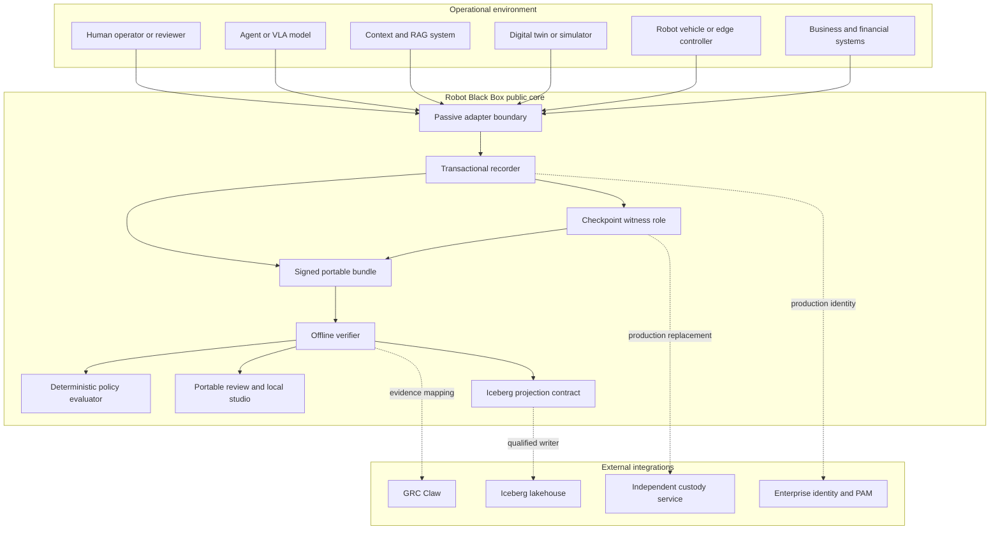

Solid lines represent local reference paths. Dashed lines are integration boundaries whose production services are not supplied by this repository.

## 2. Architectural planes

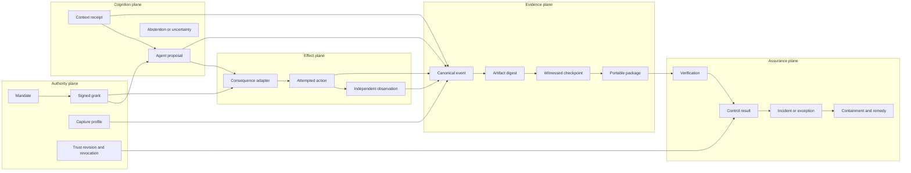

No plane can silently substitute for another. A model proposal is not a grant, an execution acknowledgement is not an outcome, and a signed record is not proof of source truth.

## 3. Capture and commit sequence

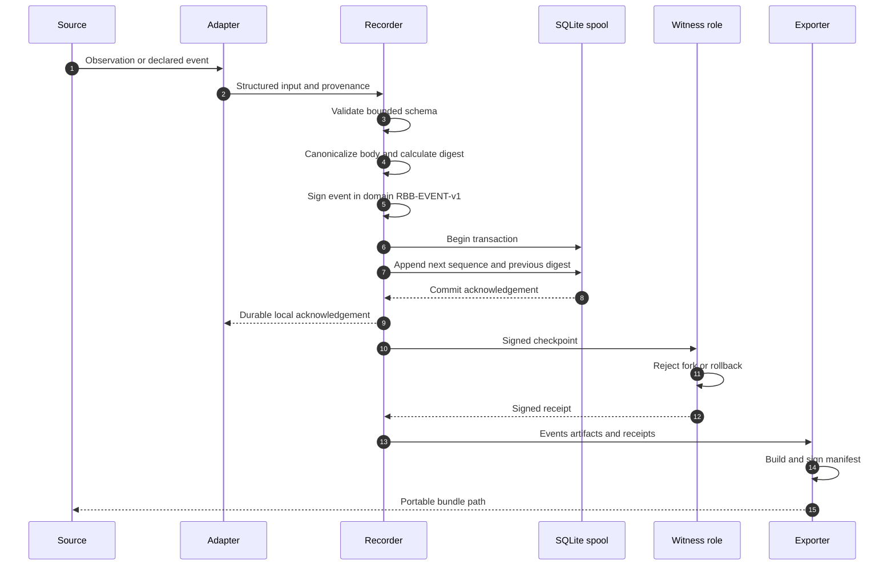

The recorder does not acknowledge a write before SQLite commits. Tests exercise process exit before commit, restart recovery, idempotent retry and conflicting duplicate rejection.

## 4. Evidence package

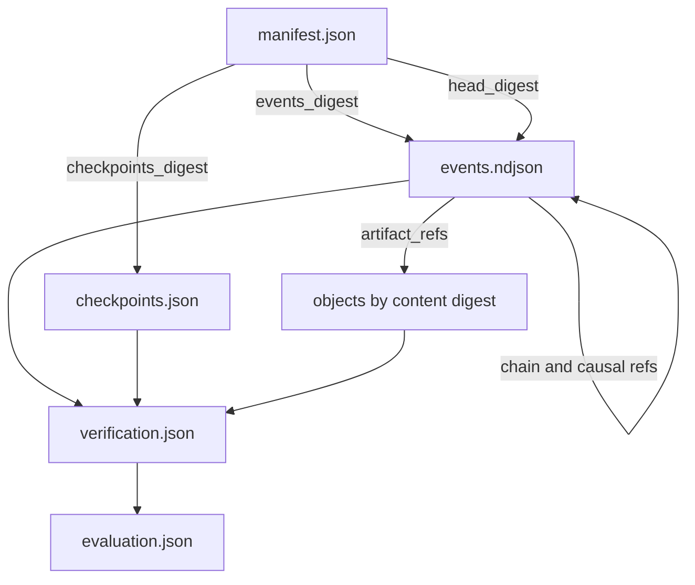

The manifest authenticates package-level commitments. Each event authenticates its own canonical body and previous event digest. Artifacts are content-addressed. Verification and evaluation are derived reports and can be recomputed.

## 5. Verification pipeline

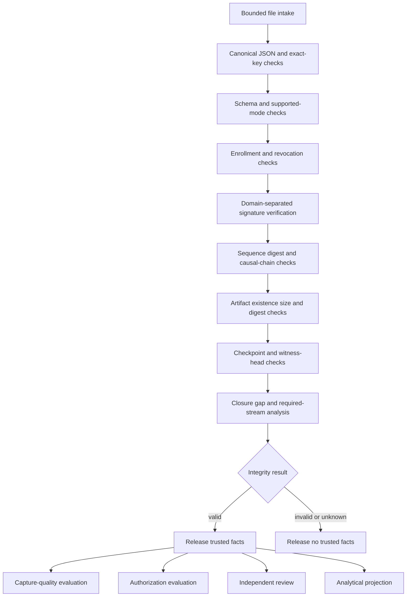

### Independent conclusions

| Conclusion | Evidence used | Does not establish |
|---|---|---|
| Integrity | Canonical bytes, signatures, chain and artifact digests | Truth, authorization or safety |
| Completeness | Closure, expected streams, gaps and available artifacts | That uncaptured reality was irrelevant |
| Anchoring | Witness receipt and supplied latest head | Global latestness or independent custody |
| Authorization | Signed grant, scope, policy and time | Successful or safe execution |
| Capture quality | Profile, channel/time diagnostics and declared limits | Sensor calibration or physical truth |
| Outcome | Recorded execution/observation fields | Causal attribution or business value |
| Custody | Receipt, identity pin, retained state and restore checks | Legal sufficiency or multi-party independence |

## 6. Trust and custody topology

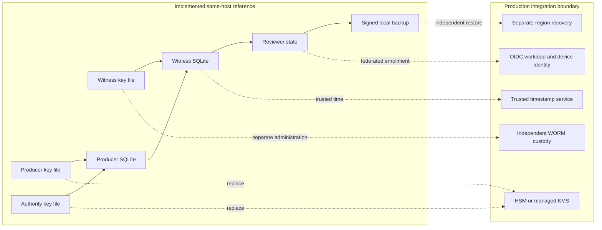

The reference implementation separates roles and processes but runs them on one host. That demonstrates protocol behavior, not organizational independence.

## 7. Policy and consequence separation

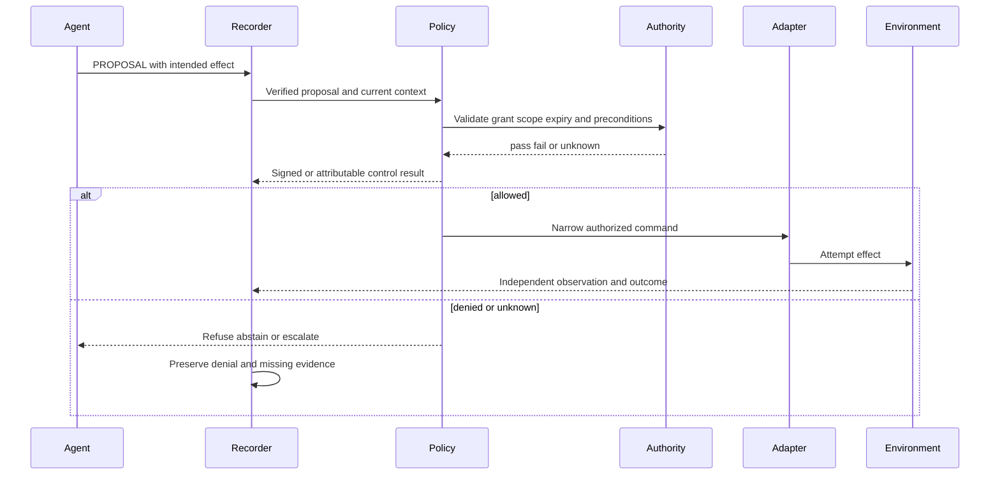

The current public demonstrations evaluate recorded synthetic actions. They do not provide a live hardware interlock.

## 8. Iceberg analytical plane

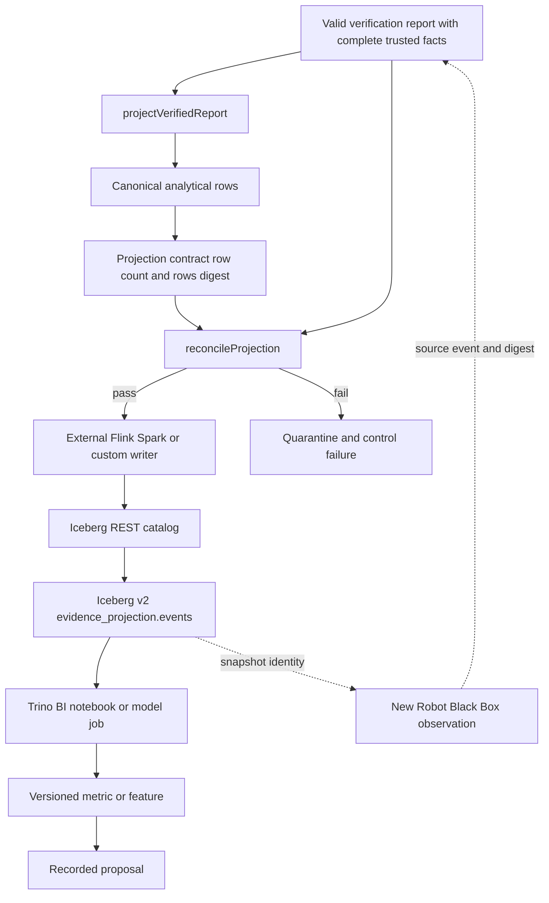

### Projection invariant

For each analytical row:

```text
(tenant_id, run_id, source_event_id, source_event_digest, source_bundle_digest)
```

must resolve to the verified source. A changed row without a changed rows digest fails reconciliation. An invalid or incomplete trusted-fact set is refused.

### Production responsibilities outside this repository

- object-store and catalog credentials;
- streaming exactly-once qualification;
- row/column access policy and tenant isolation;
- compaction, manifest rewrite, snapshot expiration and orphan cleanup;
- legal holds, deletion propagation and disaster recovery;
- query budgets, semantic metrics and model-feature governance.

## 9. GRC Claw relationship

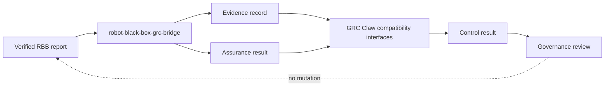

The bridge is optional and local. It demonstrates mapping, not live synchronization with an upstream deployment. Robot Black Box core builds and verifies without the compatibility modules.

## 10. Package dependency architecture

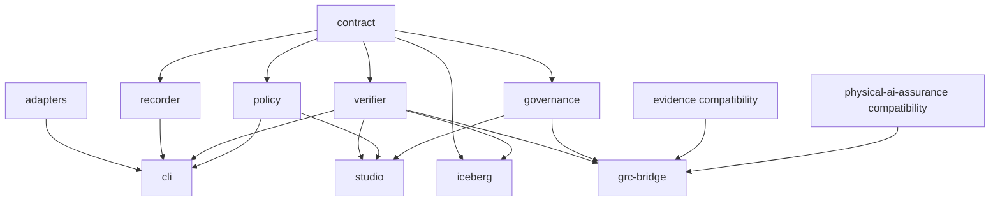

Private systems may implement public interfaces. Public packages never import private services.

## 11. Data classification and retention boundary

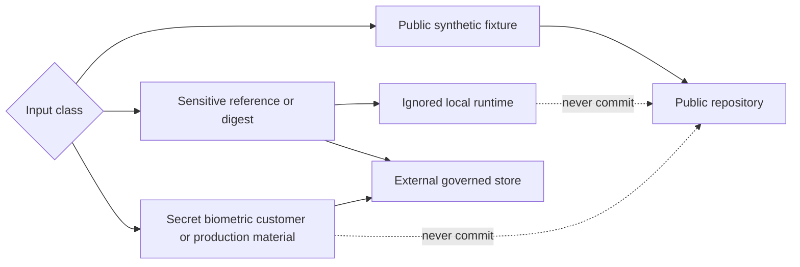

The recorder schema in this preview accepts `public_synthetic` fixtures. Production privacy classes require a separately reviewed schema, storage and lifecycle implementation.

## 12. Failure containment model

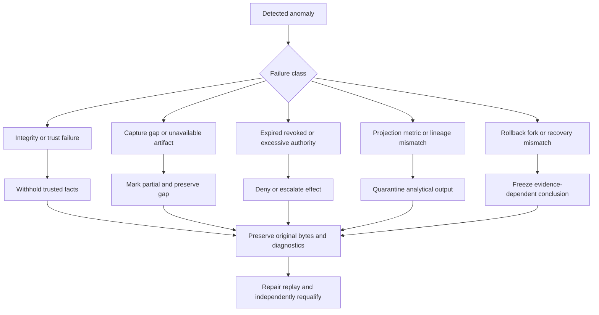

## 13. Deployment evolution

```mermaid
flowchart LR
  P0[P0 local schema and replay]
  P1[P1 offline portable review]
  P2[P2 shadow observation]
  P3[P3 independent custody pilot]
  P4[P4 bounded production]
  P5[P5 federated fleet and lakehouse]
  P6[P6 sector qualification]

  P0 -->|canonical and deterministic| P1
  P1 -->|fresh-process reconstruction| P2
  P2 -->|measured capture and false alarms| P3
  P3 -->|external identity time and restore| P4
  P4 -->|SLOs isolation and incident drills| P5
  P5 -->|cross-region custody and lineage| P6
```

| Phase | Required evidence before promotion |
|---|---|
| P0 | Canonical vectors, schema rejection and deterministic replay |
| P1 | Manifest pin, portable verification and no dependency on originating private keys |
| P2 | Passive live inputs, measured gaps, source clock uncertainty and zero actuator authority |
| P3 | Separate administrative custody, enrolled identities, trusted time and host-loss restore |
| P4 | Tenant isolation, revocation SLO, bounded effects, rollback and operational support |
| P5 | Multi-region reconciliation, governed Iceberg maintenance, lineage and cost controls |
| P6 | Applicable safety, privacy, security, legal and sector-specific qualification |

No phase inherits a safety or compliance conclusion merely because the previous phase passed.

## 14. Implemented and external boundaries

| Capability | Public implementation | Production boundary |
|---|---|---|
| Recording | SQLite transactional reference recorder | Edge durability, high-rate capture and hardware integration |
| Identity | Local generated Ed25519 roles | Enterprise PKI, workload/device identity, PAM and revocation service |
| Witness | Separate same-host process/database | Independent administrator, WORM custody and trusted timestamp |
| Verification | Offline canonical/signature/chain/artifact checks | Accredited procedures and independent operating organization |
| Policy | Deterministic synthetic authorization profile | Customer policy lifecycle and applicable legal interpretation |
| Review | Portable CLI and loopback studio | Enterprise case management, disclosure, appeal and legal hold |
| Analytics | Deterministic Iceberg row contract | Catalog, object store, streaming, BI, feature and maintenance platform |
| Physical AI | Synthetic handover and passive simulator capture | Live controller interlock, hardware validation and safety case |
| GRC | Local compatibility mapping | Hosted integration, control ownership and audit operating model |

## 15. Repository invariants

1. Invalid integrity releases no trusted facts.
2. Unknown evidence is never coerced into pass.
3. Signatures do not imply truth, authorization, completeness or safety.
4. Derived reports remain reproducible from signed source material.
5. Analytical projections retain source event and digest linkage.
6. Public packages never require private product code.
7. Runtime keys, credentials and stores never belong in the public repository.
8. Synthetic results are labeled as synthetic and do not establish live-system performance.

See [README.md](README.md) for setup, package descriptions and current validation, [OPEN-CORE-BOUNDARY.md](OPEN-CORE-BOUNDARY.md) for product separation, and [SECURITY.md](SECURITY.md) for security guidance.
