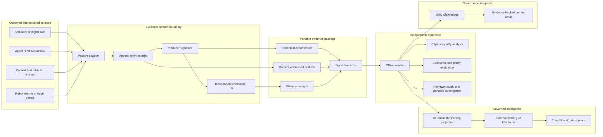
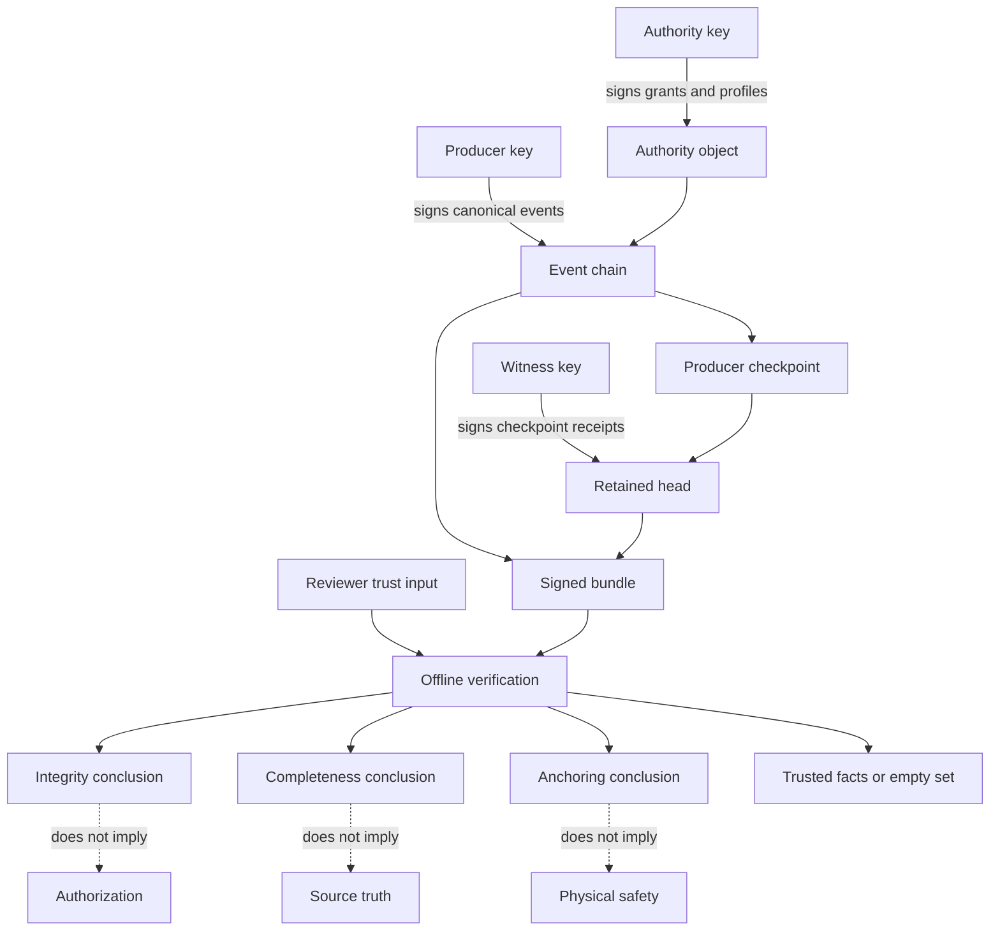
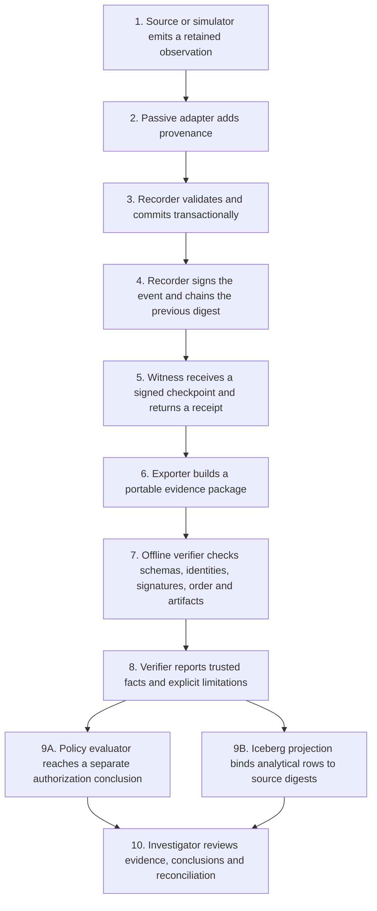
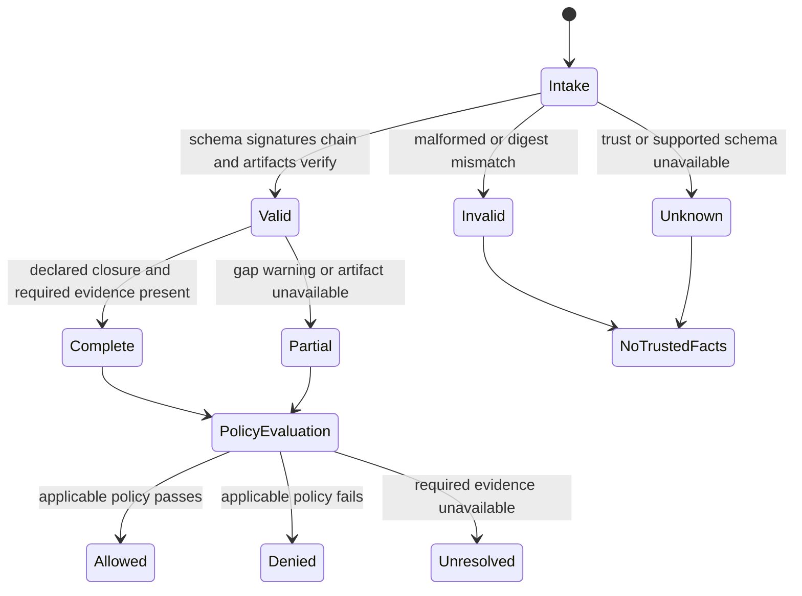
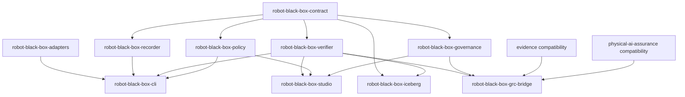
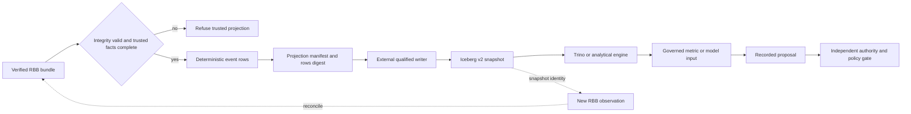
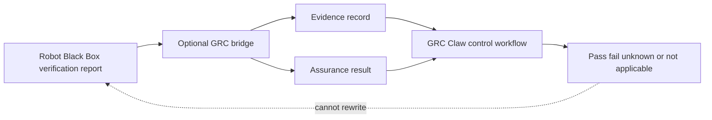
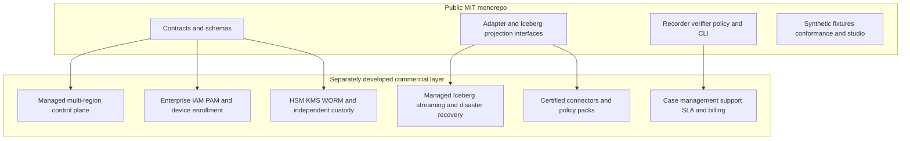

# Robot Black Box

**Verifiable incident evidence for physical AI and agent workflows, powered by [GRC Claw](https://github.com/AAH20/GRC_Claw).**

Robot Black Box is an MIT-licensed, offline-first reference implementation for recording, signing, verifying and reviewing consequential agent events. It preserves the chain from observed inputs through proposals, authority, execution and outcome without treating a cryptographic signature as proof that an action was true, safe or authorized.

The repository is a standalone monorepo. Core recording and verification require no hosted service, external package registry or installation of the full GRC Claw project.

> **Current scope:** public synthetic replay, passive simulator capture, same-host trust and custody drills, deterministic policy evaluation, portable investigation packages, a local reviewer studio and a verified-event projection contract for Apache Iceberg. It does not control hardware, run live NVIDIA Isaac GR00T inference, perform biometric identification, certify aviation equipment or provide production custody.

## Why this project exists

Traditional application logs answer fragments of an incident: which process emitted a message, when an API returned, or whether a job failed. Physical and agentic systems require a stronger reconstruction model:

- What objective and authority existed at the moment of action?
- Which model, policy, configuration, context and evidence influenced the proposal?
- Did the recorder capture every required channel, or only a valid subset?
- Was the action authorized independently from whether it succeeded?
- Can an investigator verify the package without trusting the original runtime?
- Can analytical rows, metrics and dashboards be traced back to signed events?
- What remains unknown after verification?

Robot Black Box makes those questions explicit and machine-testable.

## Contents

- [Architecture at a glance](#architecture-at-a-glance)
- [Design principles](#design-principles)
- [Trust and evidence model](#trust-and-evidence-model)
- [Evidence lifecycle](#evidence-lifecycle)
- [Quick start](#quick-start)
- [Verifier conclusions](#what-the-verifier-concludes)
- [Workspace map](#workspace-map)
- [Apache Iceberg intelligence plane](#apache-iceberg-intelligence-plane)
- [GRC Claw integration](#grc-claw-integration)
- [Public core and commercial layer](#public-core-and-commercial-layer)
- [Validation status](#validation-status)
- [Security and privacy boundaries](#security-and-privacy-boundaries)
- [Development and roadmap](#development)
- [Documentation](#documentation)

## Architecture at a glance



The signed bundle remains the evidence authority. Iceberg tables are query-optimized projections; dashboards and models do not replace custody or grant execution authority.

See [ARCHITECTURE.md](ARCHITECTURE.md) for the complete system, trust, sequence, data and deployment diagrams.

## Design principles

| Principle | Enforcement in the reference implementation |
|---|---|
| Evidence before conclusion | Invalid integrity yields no trusted facts |
| Separate conclusions | Integrity, completeness, anchoring, authorization, capture quality and outcome remain distinct |
| Explicit unknown | Missing trust, time, artifacts or required channels produces `unknown` or `partial`, never an inferred pass |
| Canonical wire format | Strict canonical JSON rejects duplicate keys, unsafe numbers and ambiguous encodings |
| Causal reconstruction | Sequence, previous digest, causal references, monotonic time and clock status remain available to reviewers |
| Purpose and tenant scope | Local studio access and exports require explicit tenant, role and purpose |
| Independent review | Portable packages can be verified in a fresh process without the originating database or private key |
| Bounded analytics | Iceberg projections retain source event, event digest and bundle digest |
| Safe publication | Runtime `.rbb` state, keys, credentials and customer material are excluded from the repository |
| Honest limitations | Synthetic replay and same-host drills are never presented as physical safety or independent custody certification |

## Trust and evidence model



A valid signature proves that enrolled key material authenticated specific bytes. It does not prove that a sensor was calibrated, a source statement was true, an action was authorized, a mission was safe or every relevant event was captured.

## Evidence lifecycle



## Quick start

### Requirements

- Node.js **22.23.0 or newer**
- `node:sqlite` and TypeScript stripping support from that runtime
- macOS or Linux for the currently exercised paths
- No registry dependencies for the shipped workspaces

### Install, build and verify

```sh
git clone https://github.com/AAH20/robot-black-box.git
cd robot-black-box
npm ci --ignore-scripts --offline --no-audit --no-fund
npm run build
npm test
```

### Run the evidence demonstrations

```sh
npm run demo
npm run verify:portable
npm run review
```

The demo creates a fresh ignored `.rbb` directory containing local keys and SQLite databases. **Never commit or publish that directory.**

Expected behavior includes:

- a baseline bundle with valid integrity;
- deliberately dropped, duplicated, reordered and delayed observations;
- failures that remain failures after signing;
- missing artifacts reported without inventing unavailable facts;
- offline verification from a checked portable package;
- reviewer state, custody, backup and recovery drills;
- deterministic Iceberg projection and tamper reconciliation.

## What the verifier concludes



These states are not a single confidence score. A bundle can have valid integrity and partial completeness. An action can succeed operationally while authorization fails. A historical checkpoint can verify while current trust freshness remains unknown.

## Workspace map



| Workspace | Responsibility |
|---|---|
| `robot-black-box-contract` | Canonical JSON, digests, signatures, schemas and event validation |
| `robot-black-box-recorder` | Transactional SQLite recording, local keys, checkpoints, witness receipts and bundle export |
| `robot-black-box-verifier` | Offline integrity, artifact, ordering, anchoring, completeness and capture diagnostics |
| `robot-black-box-policy` | Deterministic execution-time authorization evaluation |
| `robot-black-box-adapters` | Synthetic handover fixtures and reference adapter boundary |
| `robot-black-box-governance` | Signed declarations, context/retention evaluation and governance fixtures |
| `robot-black-box-cli` | Local replay, verification, evaluation and benchmark commands |
| `robot-black-box-studio` | Loopback-only reviewer console and synthetic access/retention exercises |
| `robot-black-box-iceberg` | Deterministic verified-event projection, table contract and reconciliation |
| `robot-black-box-grc-bridge` | Optional evidence and assurance mapping to GRC Claw compatibility interfaces |
| `evidence` | Selected MIT GRC Claw evidence compatibility source |
| `physical-ai-assurance` | Selected MIT GRC Claw physical-assurance compatibility source |

All workspace manifests use `private: true` to prevent accidental npm publication. That flag does not make code in this public Git repository confidential.

## Apache Iceberg intelligence plane

The Iceberg package creates an engine-neutral analytical projection. It deliberately contains no object-store credential, catalog service, streaming cluster or customer policy.



Every projected row carries:

- source event ID and event digest;
- source bundle digest;
- tenant, purpose, run, stream and sequence;
- observed and received time with clock state;
- policy/configuration digests;
- payload digest, causal references and artifact count.

See [the Iceberg projection guide](docs/robot-black-box/ICEBERG-PROJECTION.md) and [table contract](packages/robot-black-box-iceberg/src/table-contract.json).

## GRC Claw integration

The optional bridge maps verified reports into supplied local evidence and physical-assurance compatibility interfaces. Robot Black Box remains independently runnable; installing the full GRC Claw repository or connecting to a hosted service is not required.



The bridge does not establish live upstream synchronization, regulatory compliance, safety certification or production durability. Read [GRC-CLAW-INTEGRATION.md](GRC-CLAW-INTEGRATION.md) for the exact boundary.

## Public core and commercial layer

The public repository contains everything required to understand the wire contract, record locally, verify independently, reproduce the demonstrations and implement compatible adapters.

Production operations remain a separate concern:



The detailed boundary and prohibited public material are documented in [OPEN-CORE-BOUNDARY.md](OPEN-CORE-BOUNDARY.md).

## Repository layout

```text
.
├── packages/                 Public package boundaries
├── scripts/                  Builds, tests, demos and offline review tools
├── examples/                 Public synthetic and executed evidence
├── benchmarks/               Reproducible benchmark definitions and results
├── docs/robot-black-box/     Threat, governance, custody and runtime documentation
├── .github/workflows/        Repository verification workflow
├── ARCHITECTURE.md           Detailed Mermaid architecture
├── OPEN-CORE-BOUNDARY.md     Public/private product contract
├── GRC-CLAW-INTEGRATION.md   Optional upstream relationship
├── SECURITY.md               Vulnerability and security guidance
└── RELEASE-SCOPE.md          Published scope and exclusions
```

## Validation status

| Area | Current evidence | Boundary |
|---|---|---|
| Local build | Ten RBB package boundaries plus two GRC compatibility workspaces | Node 22.23.0, macOS arm64 |
| Automated tests | **99 passing locally** | Includes loopback HTTP; Windows unverified |
| Initial Linux CI | [97-test release workflow passed](https://github.com/AAH20/robot-black-box/actions/runs/35362157716) | Predates the Iceberg package and studio rename |
| Portable review | Fixed six-case package with supplied manifest pin | Historical demonstration pin, not independent enrollment |
| Simulator capture | Retained passive MuJoCo sphere-drop observations and authored fault derivatives | Does not prove live physics, calibration or sim-to-real validity |
| Custody and recovery | Separate roles and processes exercised on one host | No independent organization, HSM, trusted time or host-loss proof |
| Iceberg | Deterministic row projection and reconciliation tests | No deployed catalog, object store, Flink, Spark or Trino service |
| GRC bridge | Local mapping into bundled compatibility interfaces | No live hosted synchronization or compliance certification |

## Security and privacy boundaries

- Only public synthetic data belongs in this repository.
- Raw biometric templates and real surveillance captures are outside the project scope.
- Recorder payloads should minimize secrets and unrelated personal information.
- `.rbb` directories contain runtime keys and databases and must remain ignored.
- A valid package may still contain false source claims; verification reports this distinction.
- A local witness on the same host is not independent custody.
- Expired trust profiles are not silently renewed.
- Failed or unknown evidence remains visible and is not removed from denominators.
- Analytics and dashboards produce information or proposals, never implicit actuator authority.

Review [SECURITY.md](SECURITY.md) before integrating a new adapter or accepting evidence from an untrusted source.

## Development

Build only the independent core:

```sh
npm run build:core
```

Build the core and optional GRC compatibility modules:

```sh
npm run build
```

Run all tests:

```sh
npm test
```

Useful focused commands are documented in [docs/robot-black-box/RUNNING.md](docs/robot-black-box/RUNNING.md). Contributions should include a concrete failure fixture and an independently checkable expected result when they change a trust, evidence or policy boundary.

## Project status and roadmap

The current release is a developer preview. Near-term public work should prioritize:

1. Linux verification of the 99-test suite and the new package boundary.
2. A stable versioned event and projection compatibility policy.
3. Additional independently authored conformance fixtures.
4. A local Iceberg REST catalog, object-store and Trino demonstration using synthetic data.
5. ROS 2, LangGraph and VLA reference adapters that remain passive by default.
6. Independent custody and recovery experiments across separate administrative domains.
7. Measured investigator reconstruction studies rather than invented assurance scores.

Production claims require evidence beyond this repository: live hardware qualification, independent key custody, trusted time, operational SLOs, privacy/legal review, incident response and applicable sector approval.

## Documentation

- [Detailed architecture](ARCHITECTURE.md)
- [Open-core boundary](OPEN-CORE-BOUNDARY.md)
- [GRC Claw integration](GRC-CLAW-INTEGRATION.md)
- [Iceberg projection](docs/robot-black-box/ICEBERG-PROJECTION.md)
- [Running guide](docs/robot-black-box/RUNNING.md)
- [Capture quality](docs/robot-black-box/CAPTURE-QUALITY.md)
- [Portable investigation](docs/robot-black-box/PORTABLE-INVESTIGATION.md)
- [Custody, backup and recovery](docs/robot-black-box/CUSTODY-BACKUP-RECOVERY.md)
- [Aircraft recorder comparison](docs/robot-black-box/AIRCRAFT-BLACK-BOX-COMPARISON.md)
- [Release scope](RELEASE-SCOPE.md)
- [Security policy](SECURITY.md)
- [Contributing](CONTRIBUTING.md)

## License

Robot Black Box is released under the [MIT License](LICENSE). Third-party and bundled compatibility-source notices are recorded in [THIRD-PARTY-NOTICES.md](THIRD-PARTY-NOTICES.md).
