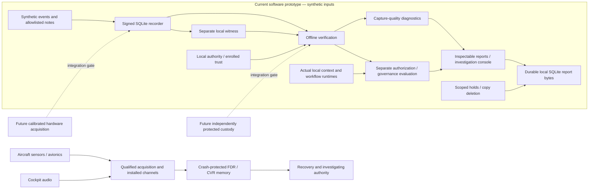

# Robot Black Box and commercial-aircraft recorders

Evidence review: 18 September 2026. Scope: the whole Robot Black Box stack and its GRC_Claw host, including recording, trust, authorization, governance, context runtimes, retention, investigation console and durable reports. This comparison concerns FDR/CVR systems on commercial aircraft; requirements vary by jurisdiction, aircraft configuration and manufacture/certification dates. It is an engineering comparison, not an aircraft approval assessment.

Robot Black Box is a local software evidence and policy prototype. Its strongest demonstrated analogy is reconstructable records with explicit provenance, gaps and access boundaries. Aircraft recorders additionally depend on qualified acquisition/installation, protected memory and independent recovery processes. The project has no demonstrated counterpart to crash-protected airborne hardware. Policy authorization and context governance are additional software functions, not evidence that it is a superior flight recorder.

## Evidence categories

**Executed local software** means actual bytes, cryptography, SDK/backend calls or bounded fault tests were run on this machine. **Synthetic** describes generated inputs and scenario outcomes even when the software processing them is real. **Fixture** describes declared integration behavior without the vendor/hardware operation. **Absent/gate** means the capability requires resources or independent assessment not delivered here. These categories can coexist: real Cognee execution on a synthetic note is not a fixture, and still is not robot sensor evidence.

## What an aircraft black box does

An FDR preserves flight/system parameters; a CVR preserves cockpit radio/intercom/aural context for investigation. These recorder functions do not authorize flight maneuvers or act as decision agents. NTSB specialists recover and analyze recordings after an occurrence. Flight/audio records supplement other evidence, rather than independently establishing a cause. [NTSB recorder overview](https://www.ntsb.gov/news/Pages/cvr_fdr.aspx).

EUROCAE publishes recorder performance specifications. ED-112B was published in 2023, and the FAA-hosted 2025 investigative-technologies report identifies Change 1 as released in December 2024. Applicable approvals can still reference ED-112A or an accepted later equivalent; publication of a newer standard does not automatically revise every aircraft's approval basis. The FAA report is committee analysis/recommendations, not a substitute for adopted rules. Full paid standard clauses were not obtained or assessed. [EUROCAE ED-112B catalog](https://www.eurocae.net/product/ed-112b-minimum-operational-performance-specification-for-crash-protected-airborne-recorder-systems/), [FAA ARC report, page 170](https://www.faa.gov/sites/faa.gov/files/Investigative-Technologies_final-report.pdf), [EASA FDR operational specifications](https://www.easa.europa.eu/en/document-library/easy-access-rules/online-publications/easy-access-rules-air-operations?erules-id=ERULES-1963177438-12701).

## Project-wide technical comparison

| Dimension | Aircraft FDR/CVR practice | This project: demonstrated state | Gap and implication |
| --- | --- | --- | --- |
| Purpose | Reconstruct aircraft movement, systems and cockpit context. [NTSB](https://www.ntsb.gov/news/Pages/cvr_fdr.aspx) | Signed event/artifact reconstruction; separate task outcome, authority and governance results. [Recorder](../../packages/robot-black-box-recorder/src/index.mjs), [policy](../../packages/robot-black-box-policy/src/index.mjs) | Useful analogy for investigation; no aircraft/robot safety certification. |
| Channels | Flight parameters and cockpit audio are distinct acquisition functions. [NTSB](https://www.ntsb.gov/news/Pages/cvr_fdr.aspx) | Observation, proposal, approval, execution, configuration, gap and closure events; synthetic artifacts. [Strict schema](../../packages/robot-black-box-contract/src/event.schema.json) | No genuine cockpit audio, flight-bus import or calibrated robot sensor channel. Demo narration is presentation media, not a CVR recording. |
| Sampling and engineering values | Prescribed ranges, accuracy, recording intervals and resolution depend on applicable parameter tables. [EASA FDR specifications](https://www.easa.europa.eu/en/document-library/easy-access-rules/online-publications/easy-access-rules-air-operations?erules-id=ERULES-1963177438-12701) | Declared units/frame/source offsets; new signed capture-profile diagnostics check channel/count/interval semantics. [Capture quality](../../packages/robot-black-box-verifier/src/capture-quality.mjs) | Abstract string-valued observations have no qualified engineering conversion, sensor accuracy or measurement uncertainty chain. |
| Time alignment | Installation analysis includes parameter correlation and dropout/noise examination. [FAA AC 20-141B](https://www.faa.gov/documentLibrary/media/Advisory_Circular/AC_20-141B.pdf) | Monotonic order, observation/receive times, clock status/uncertainty and expiry-boundary evaluation; new wall-time rollback/different-clock diagnostics. | No validated multi-sensor synchronization or externally trusted timestamp authority. A recent verification does not make old replay live. |
| Continuous capture | Operational rules prescribe start/stop and retention behavior for applicable installations. [EASA Air Operations](https://www.easa.europa.eu/en/document-library/easy-access-rules/online-publications/easy-access-rules-air-operations?erules-id=ERULES-1963177438-12701) | Transactional append, duplicate conflict refusal, explicit gaps; nine finite scheduled checks across six processes. [Operational receipt](../../examples/robot-black-box-governance/executed/operational-assurance-execution.json) | The timer verifies/checkpoints a local supplied stream. It does not subscribe to all real sources, prove complete capture or run a qualified fleet SLA. |
| Retention window | FAA's 2026 CVR rule expands retention to 25 hours for affected new production, with differentiated scope/transitions; older fleets are not all retrofitted by this rule. [Official final rule](https://www.govinfo.gov/content/pkg/FR-2026-02-02/pdf/2026-02110.pdf), [May correction](https://www.govinfo.gov/content/pkg/FR-2026-05-08/pdf/2026-09143.pdf) | Run bundles retained; separate managed copies, owned synthetic context stores and durable report copies have explicit deletion/hold scopes. [Retention](CONTEXT-RETENTION.md) | No prescribed airborne rolling window or incident-triggered physical freeze. Zero-time synthetic purge policy is not a production retention schedule. |
| Power interruption | Recorder-system installation/operational approval is assessed separately from component performance. [FAA CVR installation guidance](https://www.faa.gov/airports/resources/advisory_circulars/index.cfm/go/document.information/documentID/1042714) | SQLite WAL/FULL, atomic file/directory synchronization, child-process rollback and checkpoint retry. | Executed process-crash recovery does not establish sudden power-loss survival, battery-backed capture or filesystem/device endurance. |
| Impact/fire/water | Protected memory must survive defined physical test conditions; recorders can still be destroyed. [ATSB crashworthiness fact sheet](https://www.atsb.gov.au/sites/default/files/media/4793913/Black%20Box%20Flight%20Recorders%20Fact%20Sheet.pdf) | Laptop/filesystem only. MuJoCo passive sphere physics is real execution on a synthetic scenario. [Runtime review](LOCAL-RUNTIME-REVIEW.md) | No impact/fire/immersion/pressure qualification, enclosure, locator or survivable memory. Hash chaining and sphere simulation provide none of these protections. |
| Redundancy and recovery | Combined/separate/deployable options and timely recovery involve installation-specific designs, not a universal cloud mirror. [FAA investigative-technologies report](https://www.faa.gov/sites/faa.gov/files/Investigative-Technologies_final-report.pdf) | Separate local spool, witness and service databases; digest-verified durable report readback. [Durable bridge](../../packages/robot-black-box-grc-bridge/src/durable.mjs) | Multiple databases on one host share loss/compromise risks. No independent remote replica, external escrow or tested disaster recovery. |
| Independent investigation | Recorders are transported to an investigation laboratory for specialist analysis. [NTSB](https://www.ntsb.gov/news/Pages/cvr_fdr.aspx) | Offline Node verifier plus Python/OpenSSL implementation; localhost investigation notes cite events. [Independent verifier](../../scripts/robot-black-box/verify-independent.py) | Independent implementation differs from independent custodian/investigator. Same-machine supplied keys/heads can be replaced by a host-controlling attacker. |
| Voice/privacy/access | US CVR release and discovery have specific statutory restrictions; EASA addresses preservation/use. [49 USC 1154](https://uscode.house.gov/view.xhtml?edition=prelim&path=%2Fprelim%40title49%2Fsubtitle2), [EASA preservation/use](https://www.easa.europa.eu/en/document-library/easy-access-rules/online-publications/easy-access-rules-air-operations?erules-id=ERULES-1963177438-12292) | Public synthetic data only; tenant roles/purpose gates, encrypted managed copies, distinct holds and scoped purge. No voice/surveillance capture. | Local bearer tokens and separate file keys are not production identity assurance or CVR privacy compliance. Every copy's retention must be tracked explicitly. |
| Cyber integrity/key compromise | Physical recorder standards do not justify a blanket claim that every aircraft recorder encrypts or cryptographically signs all channels. No universal guarantee is assumed here. | SHA-256/Ed25519, separate authority/witness domains, unknown/revoked key refusal, dual-key rotation and historical/current trust distinction. [Trust lifecycle](../../packages/robot-black-box-recorder/src/trust-lifecycle.mjs) | Evidence integrity is relative to trusted enrollment, head and host custody; signatures cannot fix compromised acquisition or same-host trust replacement. |
| Provenance/source truth | Recorded flight data itself has source, sampling and resolution limitations. [EASA FDM guidance](https://www.easa.europa.eu/en/document-library/easy-access-rules/online-publications/easy-access-rules-air-operations?erules-id=ERULES-1963177438-12216) | Digest-bound adapters, source offsets, synthetic labels, real context source citations/restart receipts. | Authentic bytes are not proof that a sensor measured reality or an extracted relationship is true. Calibration/source authentication require independent evidence. |
| Software/product assurance | Airborne software approval uses defined development-assurance objectives; it is more than passing unit tests. [FAA AC 20-115D](https://www.faa.gov/airports/resources/advisory_circulars/index.cfm/go/document.information/documentNumber/20-115D), [RTCA DO-178](https://www.rtca.org/do-178/) | Versioned strict local contract, tests/fault vectors, source/lock inventories and configured CI. | No assessed airborne software-assurance process, qualified toolchain or production manufacturing control. Tests cover this prototype, not every GRC_Claw module. |
| Equipment vs installation approval | FAA TSO authorization addresses an article's minimum performance; it is not permission to install/use that article on any aircraft. [FAA TSO explanation](https://www.faa.gov/aircraft/air_cert/design_approvals/tso) | Local prototype with no TSO/ETSO authorization, approved installation or aircraft interface. | Neither repository schemas nor a GRC control mapping create any of those approvals. |
| Maintenance/readiness | Recording inspections/serviceability and parameter calibration checks are operational obligations with conditions and exceptions. [EASA recorder checks](https://www.easa.europa.eu/en/document-library/easy-access-rules/online-publications/easy-access-rules-air-operations?erules-id=ERULES-1963177438-12292) | Bounded stale/current local verification, explicit failed persistence, signed capture-quality profiles and immutable report-copy acknowledgements. | No installed-system maintenance program, real sensor calibration owner or unattended production readiness qualification. |
| Legal evidence | US law separately regulates discovery/use of cockpit recordings and Board reports. [49 USC 1154](https://uscode.house.gov/view.xhtml?edition=prelim&path=%2Fprelim%40title49%2Fsubtitle2) | Inspectable signed bytes and local audit/access records. | Cryptographic validity does not determine admissibility. Jurisdiction, evidence handling, authenticity and procedural rules require case-specific assessment. |

## The rest of the project has no direct FDR/CVR equivalent

| Project layer | Actual delivery and evidence | Boundary relative to aircraft recording |
| --- | --- | --- |
| Authority and agentic governance | Separate action grants; synthetic VLA/twin/biometric declarations; 20 authored governance interventions, 200 trials matching authored expectations. [Review](GOVERNANCE-REVIEW.md) | Recorders preserve what occurred. This evaluator additionally assesses supplied software authority/control predicates; it never commands motion. A metadata control match is not aircraft safety approval. |
| Context/workflow runtimes | Marked synthetic Markdown reads, actual LangGraph interrupt/restart, actual Cognee add/cognify/CHUNKS retrieval with local Qwen/MiniLM and SQLite/LanceDB restart. [Semantic review](SEMANTIC-RUNTIME.md) | Investigation/support context is additional evidence. Retrieved text and model extraction never enroll keys or grant authority. No GR00T robot inference, real biometric matching or proprietary twin was executed. |
| Simulation | Actual MuJoCo 1,000-step passive drop; synthetic model/asset, no sim-to-real assessment. [Local runtime](LOCAL-RUNTIME-REVIEW.md) | Simulation is a test instrument, not a recorder crash/fire test or flight measurement. |
| Retention | Actual Lance table deletion plus removal of one dedicated regenerable synthetic source store; injected detach crash recovery; held and other-tenant sources remained available. [Receipt](../../examples/robot-black-box-governance/executed/context-retention-execution.json) | Applies only to owned context copies. Original vault, signed evidence and digest receipts remain; physical erasure and external vendor deletion are unknown. |
| Commercial/GRC operations | Tenant/purpose console, investigation notes, advisory policy registry, managed-copy privacy operations and actual local durable report bytes. [Operational bridge result](../../examples/robot-black-box-governance/executed/operational-durable-grc-bridge.json) | Recurring evidence operations are software services around records. No enterprise SSO, independent custody, hosted SLA or aviation installation approval. |
| Surrounding GRC_Claw platform | Identity/action/evidence primitives, reference mappings, decision-support/reporting and integration modules have mixed maturity. [Host claims boundary](../CLAIMS_AND_LIMITATIONS.md), [executive overview](../EXECUTIVE_OVERVIEW.md) | The comparison covers their role, not an audit of every package. Financial estimates, framework mappings and executive metrics do not qualify a recorder or establish operating effectiveness. |

Measured workloads remain specific: seven handover cases × 50 seeds matched 350/350 authored integrity/authorization labels; twenty governance cases × ten seeds matched 200/200 authored outcomes. The full Robot Black Box suite passed 40/40 tests, preserving the 36-test operational baseline and adding four capture tests; these are distinct from those benchmarks. None is an aircraft accident reconstruction study, calibrated robot performance test or external gold-label review. [Original measurements](RELEASE-REPORT.md), [governance measurements](GOVERNANCE-REVIEW.md).

## Improvement implemented from this comparison

The missing local distinction was capture quality separate from signed-record integrity. A trusted CAPTURE-PROFILE now pins tenant/system/run, validity, required sensor, units/frame, clock/uncertainty, expected synthetic count and optional interval. Read-only diagnostics refuse untrusted/expired/revoked profiles, distinguish observation/receive time, check observed-time rollback and monotonic cadence, and cite affected event IDs. Open streams cannot be called missing solely because a declared count is not yet reached. Sampling without a contract, cross-clock comparisons, physical calibration and live capture remain unknown. It does not change old schemas, bundles or authorization decisions.

Six executed fresh signed bundles all verified as valid: declared baseline unknown; missing channel fail; wrong units fail; wall-time rollback fail; cadence gap fail; uncertain clock unknown. A separate process authenticated receipts and recomputed all six outputs byte-for-byte as of original evaluation time. [Execution](../../examples/robot-black-box-capture-quality/executed/execution.json), [recovery](../../examples/robot-black-box-capture-quality/executed/recovery.json), [tests](../../scripts/test-robot-black-box-capture-quality.mjs), [running guide](CAPTURE-QUALITY.md). No aircraft crash qualification is inferred. Existing 350/200-trial benchmark artifacts remain unchanged.

## Architecture and evidence boundaries

The two paths illustrate roles, not interoperability. There is no data connection from this prototype into aircraft controls. The project policy/report path is read-only here and has no actuation credentials. Separate local databases do not constitute physically independent custody.

## Prioritized gap-closure roadmap

| Workstream | Next concrete gate | Acceptance evidence | Boundary |
| --- | --- | --- | --- |
| Local software, first | Stable export/profile contract; source-aware quality records; bounded real capture adapters; measured disk/backpressure and multi-epoch recovery | Independent reader round trip, injected truncation/full-disk/reboot tests, trusted source-to-record expected-channel comparison | Software tests cannot qualify a physical recorder. New diagnostics close only the declared synthetic channel/time portion. |
| Independent custody, parallel | Protected signer enrollment, separate-account witness/escrow, immutable remote receipts and explicit revision/revocation distribution | Two independent operators reproduce verification; producer-host compromise cannot rewrite trusted heads; restore/reconciliation exercise | Requires separately operated infrastructure and custody threat model, not another database on this laptop. |
| Real hardware, after approved scope | Benign lab acquisition with calibration/time references, source tap completeness and isolated safety boundary | Measured signal generation/capture comparison, latency/loss/clock uncertainty budgets, power interruption/endurance results | Passive data access first; no motion authority. Crash-protected memory/enclosure/locator requires specialized hardware and accredited testing. |
| Formal qualification, application-specific | Agree intended equipment/installation and jurisdictional basis with qualified partners; conduct hazard/development/manufacturing/maintenance assurance | Reviewed requirements-to-test traceability, controlled tooling/configuration, independent test/qualification reports and required approvals | No inferred TSO/ETSO, airworthiness, ISO certification or legal admissibility from open-source reports. |

Do not start by purchasing a protective enclosure and calling the software airborne-qualified. First specify intended source, channel contract, failure model and investigative use; assess each software, custody and physical gate with its own acceptance evidence. Costs and timing require a defined deployment, partners and hardware, so no unsupported ranking or universal budget is offered.

## OSS and commercial positioning

Publish inspectable schemas, recording/verifier/profile logic, failure vectors and export contracts. Commercial work can center on authenticated connectors, independent witness operation, key/custody management, retention-aware evidence lifecycle, restoration drills and recurring investigation/control reports. Price supported operations and delivery responsibility against measured scope. The supported claim is an inspectable software evidence layer for AI-agent operations; “certified aircraft black box,” “crash proof,” “calibrated robot recorder” and automatic compliance are unsupported.

Related concise deliverable: [stakeholder one-page comparison](AIRCRAFT-BLACK-BOX-ONE-PAGE.md). Standards source review is a public-document comparison, not a clause-by-clause assessment of ED-112 or a legal opinion.

## Portable investigation milestone

The public synthetic six-case suite now travels with original signed bundles, historical public trust, authority-signed capture profiles and offline verifier/policy modules. Two detached fresh-process reviews reproduced the same reports; the full local regression suite passed 50/50 tests. Transport completeness, cryptographic integrity, authorization and capture quality remain separate; current online trust, source truth, external custody and hardware qualification are not established. See [PORTABLE-INVESTIGATION.md](PORTABLE-INVESTIGATION.md) for runnable commands, intake limits and the required external trust/pin boundary.

## Portable package integrity bootstrap

A standalone reviewer-side Node bootstrap now checks a mandatory externally supplied manifest SHA-256 and bounded file inventory before running included package code from a private verified snapshot. Six fresh-process demonstrations rejected coherent tool/evidence plus manifest rewrites and absent/wrong pins, then recovered from a clean copy. All 61 local tests passed; original 50 are preserved. The demo pin is explicitly same-host-generated, so independent pin distribution, bootstrap authenticity, external custody and enrollment remain open gates. Commands and trust boundaries: [PORTABLE-INVESTIGATION.md](PORTABLE-INVESTIGATION.md#reviewer-side-pin-bootstrap). No publisher seal or new signature scheme was added.

## Local custody and restore milestone

Separately keyed acceptance of the preserved public synthetic package now binds its manifest/inventory/grant digests, declared timestamp, tenant and purpose. Explicit reviewer pinning of custodian identity precedes receipt verification; trusted bootstrap review of restored evidence remains separate. Ten fresh custody processes executed real pre/post-commit crashes, retry, tampered/missing content, receipt/identity denial and clean restore after assembly removal. The full local suite passed 70/70 tests. This is same-host logical immutability/recovery, not independent custody, trusted time, off-host disaster recovery or physical survivability. Commands, public receipts and future HSM/replication/trust-distribution gates: [LOCAL-CUSTODY-RESTORE.md](LOCAL-CUSTODY-RESTORE.md).

## Custody-store loss recovery milestone

A signed bounded SQLite backup now supports restoration after the original custody database/assembly/private worker configs are removed. Recovery requires separate custodian identity and intended backup-receipt pins, checks bytes before opening the snapshot, validates custody and restores the unchanged package before trusted bootstrap review. The executed same-host isolated-copy drill recovered 47 files/six valid signed cases; all 81 local tests passed. It does not demonstrate off-host replication, host/media-loss recovery, independent pin distribution or production RTO/RPO. See [CUSTODY-BACKUP-RECOVERY.md](CUSTODY-BACKUP-RECOVERY.md).

## Signed enrollment during recovery

The recovery-trust entry point now verifies existing authority-signed lifecycle revisions under an external authority pin and reviewer-held revision floor before using custodian enrollment. Executed recovery denied revoked, expired and rollback trust, then restored a fresh successor-key acceptance under revision 4; no historical revocation override or old-backup re-signing was added. All 93 local tests passed. Global latest-revision discovery, independent trust distribution and durable reviewer floor management remain open; low-level key-map recovery does not establish signed current enrollment. See [RECOVERY-TRUST.md](RECOVERY-TRUST.md).

## Durable reviewer floor milestone

Reviewer-owned SQLite state now retains accepted signed revisions/digests across restarts, rejects lower caller minima and same/higher-revision forks, and commits trust before backup recovery. Actual pre/post-commit exits and retained-floor recovery verified six signed cases; all 100 local tests passed. Explicit profile anchors remain externally supplied demonstration trust. Privileged state rollback, lost-state re-enrollment and discovery of unprovided newer revisions still require external monotonic state/trust distribution. See [REVIEWER-STATE.md](REVIEWER-STATE.md).

## Separately retained reviewer checkpoint

A distinct signer now checkpoints exact reviewer anchors, accepted revision/digest and chained checkpoint sequence. Checkpoint-gated recovery requires external signer/profile/latest-sequence-and-digest pins and rejects an actual older valid database replacement, altered/older checkpoints and missing state. A clean retained matching state copy passed verification and restored six signed cases. All 111 local tests passed. Same-host retention is not independent or hardware-backed rollback protection; replacing every retained pin/copy remains outside this profile. No automatic state repair erases history. See [REVIEWER-CHECKPOINT.md](REVIEWER-CHECKPOINT.md).

The consolidated public review now presents eight separate evidence layers, six capture cases and five aircraft investment gaps, with historical/current expiry labels and exact source citations. All 115 local tests passed, with desktop/mobile browser verification and tenant isolation checks. See [CONSOLIDATED-REVIEW.md](CONSOLIDATED-REVIEW.md) for the read-only report command, console and limitations.

Observed passive MuJoCo sample capture now records 100 engine samples across three channels (300 baseline observations) through the existing signed recorder and witness. Dropped, duplicate and delayed-receipt derivatives fail diagnostics; out-of-order source offsets trigger the existing integrity rejection. All 118 local tests passed. Simulation/host clocks and file-mediated ingestion remain explicit, with no physical calibration or live-source claim. See [SIMULATION-CAPTURE.md](SIMULATION-CAPTURE.md).
